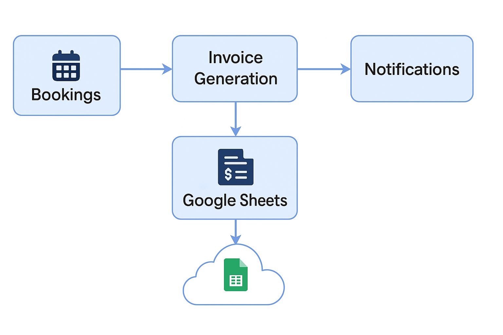
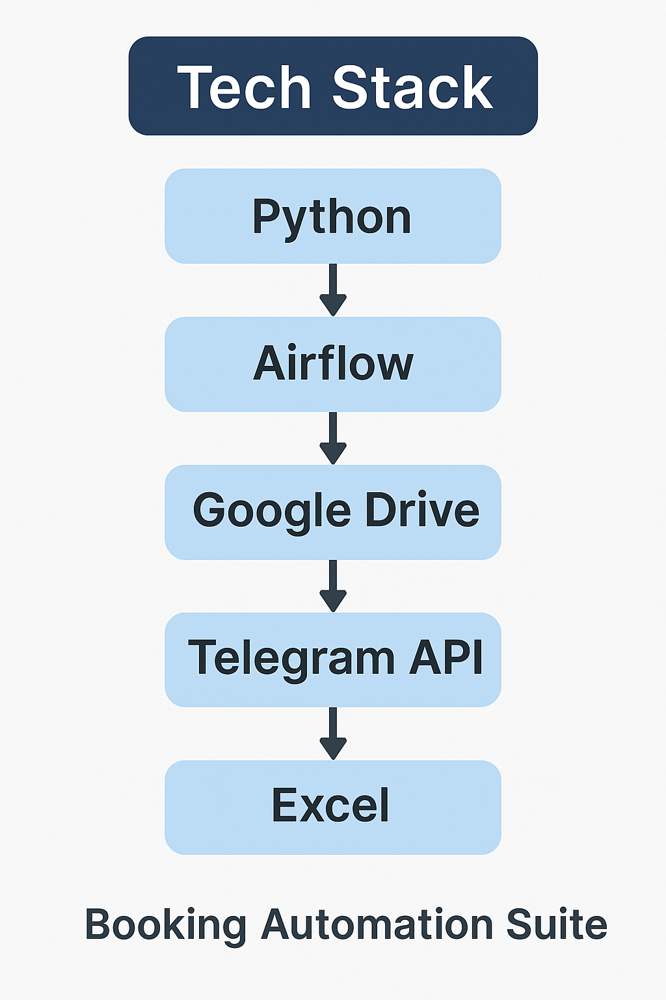
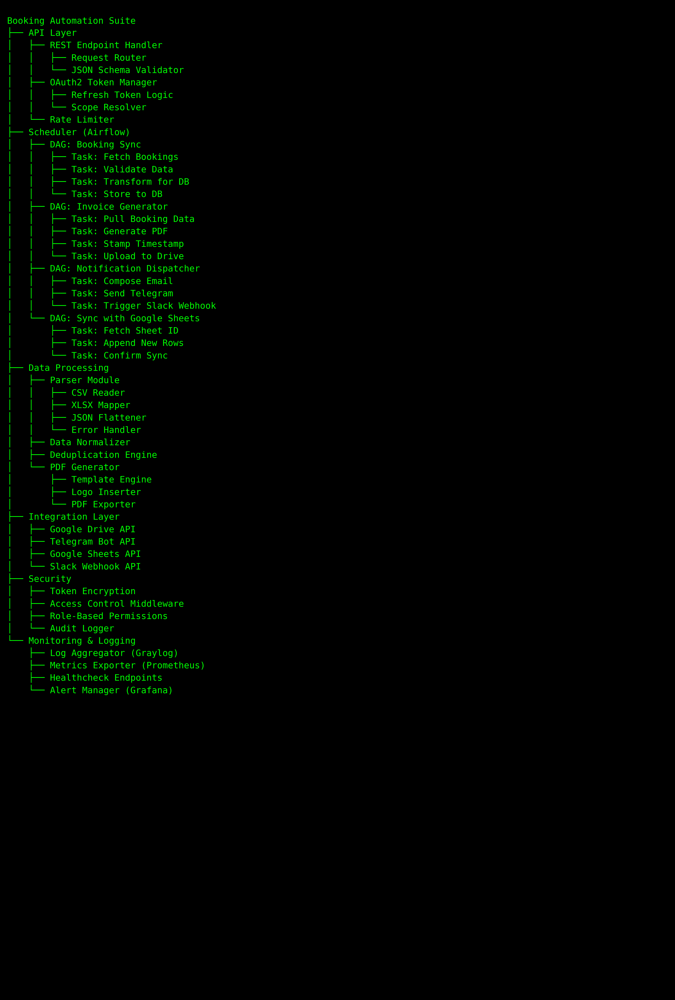

# Booking Automation Suite

Automates reservation handling, invoice generation, and notification workflows for accommodation businesses.

## Features

- Import bookings from CSV files
- Generate PDF invoices from templates
- Notify managers via Telegram (WhatsApp optional)
- Export contacts to cloud-compatible format

## Stack

- Python 3.11
- Pandas, OpenPyXL
- Telegram Bot API
- Google Sheets API (optional)
- CSV/iCal support

---

## Demo Architecture

### 1. System Architecture Overview

---

### 2. Technology Stack

---

### 3. Terminal-Style System Tree

This is what happens when automation grows roots.

